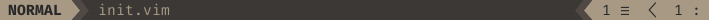

# My [Neovim](https://neovim.io/) config file 

* ##### [Installation](#installation)
* ##### [Plugins](#plugins)
* ##### [Custom airline](#custom-airline)

<br>
<br>

## :wrench: Installation
Clone this repo to your `.config` folder, which on my case is in `$HOME/.config`

``` bash
git clone https://github.com/diovanii/nvim $HOME/.config
```

<br>

## :electric_plug: Plugins
* **[coc.nvim](https://github.com/neoclide/coc.nvim)**
* **[gruvbox](https://github.com/morhetz/gruvbox)**
* **[markdown-preview](https://github.com/iamcco/markdown-preview.nvim)**
* **[nerdtree](https://github.com/scrooloose/nerdtree)**
* **[ultisnips](https://github.com/sirver/UltiSnips)**
* **[vim-airline](https://github.com/vim-airline/vim-airline)**
* **[vim-airline-themes](https://github.com/vim-airline/vim-airline-themes)**
* **[vim-devicons](https://github.com/ryanoasis/vim-devicons)**
* **[vim-javascript](https://github.com/pangloss/vim-javascript)**
* **[vim-nerdtree-syntax-highlight](https://github.com/tiagofumo/vim-nerdtree-syntax-highlight)**
* **[vim-pasta](https://github.com/sickill/vim-pasta)**
* **[vim-repeat](https://github.com/tpope/vim-repeat)**
* **[vim-surround](https://github.com/tpope/vim-surround)**

<br>

## :art: Custom [Airline](https://github.com/vim-airline/vim-airline)


_The **`☰`** represents the current line and the **`:`** symbol represents the current column._

``` vim
let g:airline_powerline_fonts = 1
let g:airline_section_x = 0
let g:airline_section_y = 0
let g:airline_section_error = 0
let g:airline_section_warning = 0
let g:airline#extensions#branch#enabled = 1
let g:airline_section_z = airline#section#create_right(["%{line('.')} ☰ "," %{col('.')} :"])
```

<br>
<br>
<br>
<br>
<br>

###### This repository is under the [MIT License](https://opensource.org/licenses/MIT) :page_with_curl:
